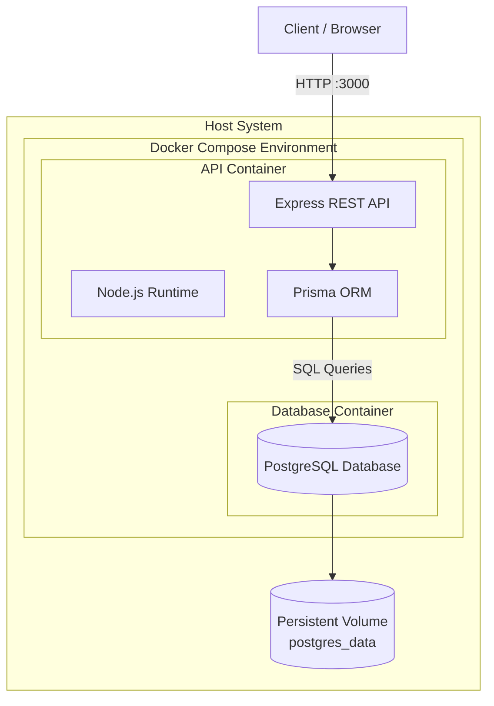

# Produtos API – Docker Compose Deployment

API REST para gerenciamento de produtos desenvolvida com **Node.js, Express, TypeScript e Prisma ORM**, utilizando **PostgreSQL** como banco de dados.

Este projeto demonstra a **containerização de uma aplicação backend utilizando Docker Compose**, permitindo um ambiente reproduzível, escalável e padronizado para desenvolvimento e execução.

---

# Tecnologias Utilizadas

* Node.js
* Express
* TypeScript
* Prisma ORM
* PostgreSQL
* Docker
* Docker Compose

---

# Arquitetura do Projeto

A aplicação foi containerizada utilizando **Docker Compose**, separando os serviços em containers independentes.

## Arquitetura Containerizada



---

# Estrutura do Projeto

```
project
│
├── prisma
│   ├── migrations
│   └── schema.prisma
│
├── src
│   ├── controllers
│   ├── routes
│   ├── services
│   └── server.ts
│
├── Dockerfile
├── docker-compose.yml
├── package.json
└── README.md
```

---

# Serviços do Docker Compose

O projeto utiliza dois containers principais:

| Serviço | Descrição                        |
| ------- | -------------------------------- |
| **app** | API Node.js com Express e Prisma |
| **db**  | Banco de dados PostgreSQL        |

---

# Variáveis de Ambiente

Exemplo utilizado pelo projeto:

```
DATABASE_URL=postgresql://postgres:postgres@db:5432/appdb
PORT=3000
```

---

# Executando o Projeto

## Pré-requisitos

* Docker instalado
* Docker Compose instalado

---

## Clonar o repositório

```
git clone <URL_DO_REPOSITORIO>
cd produtos-api
```

---

## Subir os containers

```
docker compose up --build
```

Esse comando irá:

1. Construir a imagem da aplicação
2. Iniciar o container do PostgreSQL
3. Criar a rede entre containers
4. Aplicar as migrations do Prisma
5. Iniciar o servidor da API

---

# Acessando a API

Após iniciar os containers, a API estará disponível em:

```
http://localhost:3000
```

---

# Comandos Úteis do Docker

Subir containers:

```
docker compose up
```

Parar containers:

```
docker compose down
```

Rebuild da aplicação:

```
docker compose up --build
```

Listar containers:

```
docker ps
```

---

# Persistência de Dados

O banco de dados utiliza um **volume Docker** para garantir persistência dos dados.

```
postgres_data
```

Isso permite que os dados continuem existindo mesmo após reiniciar os containers.

---

# Healthcheck

O container do PostgreSQL utiliza um **healthcheck** para garantir que o banco esteja pronto antes da aplicação iniciar.

---

# Segurança

A aplicação é executada dentro do container utilizando um **usuário não-root**, seguindo boas práticas de segurança em ambientes containerizados.

---

# Troubleshooting

## Porta 5432 já em uso

Se ocorrer o erro:

```
Bind for 5432 failed: port is already allocated
```

Altere a porta do PostgreSQL no `docker-compose.yml`.

Exemplo:

```
5433:5432
```

---

## Erro de permissão no TypeScript build

Garantir que o Dockerfile atribua permissões para o usuário da aplicação:

```
chown -R appuser:appgroup /app
```

---

# Evidência de Funcionamento

Após subir os containers, é possível verificar:

Containers ativos:

```
docker ps
```

Conexão com o banco:

```
docker exec -it dimdim-postgres psql -U postgres -d appdb
```

---

# Objetivo Acadêmico

Este projeto foi desenvolvido como parte da disciplina **DevOps Tools & Cloud Computing**, demonstrando a migração de uma aplicação tradicional para uma arquitetura baseada em containers utilizando **Docker Compose**.

---

# Autor

Projeto desenvolvido para fins acadêmicos.
